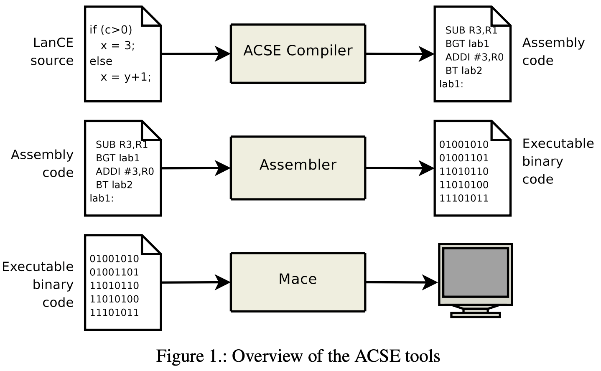

# What is Acse?
ACSE (Advanced Compiler System for Education) is a simple toolchain developed for educational purposes for the course “Formal Languages and Compilers” at Politecnico di Milano.

# Basics
The toolchain aims to be a representative example of a complete computing system – albeit simplified – in order to illustrate what happens behind the scenes when a program is compiled and then executed.

The ACSE package is comprised of three tools (whose relationship is shown in fig. 1):
* The first tool is the ACSE compiler, which accepts a program in a simplified C-like language called LANCE (Language for Compiler Education), and produces a compiled program in assembly language for a fictional architecture named MACE (Machine for Advanced Compiler Education).
* The second tool is an assembler, which is able to take the assembly language code produced by ACSE and transform it to a binary executable object file.
* The last tool is a simulator, named MACE just like the fictional architecture it implements. This simulator is able to read the object files produced by the assembler and interpret them, thus executing the program originally compiled by ACSE.

<p align="center">
  
</p>

# How to use Acse
ACSE was tested on the following operating systems:
* Linux (any recent 32 bit or 64 bit distribution should work)
* macOS (any recent version should work)
* Windows (both 32 bit or 64 bit) when built with MinGW under MSYS2, or inside Windows Services for Linux (WSL).

If you are using Linux or macOS, ACSE requires the following programs to be installed:
* a C compiler (for example GCC or clang)
* GNU bison
* GNU flex
If you use Windows, first you must install either the MSYS2 environment or Windows Services for Linux (WSL). Both MSYS2 and Windows Services for Linux (WSL) provide a Linux-like environment inside of Windows. Once you have installed either MSYS2 or WSL, you can use the following instructions just as if you were using Linux or macOS.

# Building Acse
To build the ACSE compiler toolchain, open a terminal and type ```make```.

The built executables will be located in the bin directory.

# Testing ACSE
To compile some examples (located in the directory tests) type ```make tests```

# Using ACSE
In order to use the compiler/assembler/simulator, first you have to export the directory ```./bin``` in your current PATH as follows ```export PATH=`pwd`/bin:$PATH```.

You can compile and run new Lance programs in this way (suppose you have saved a Lance program in myprog.src):
```
  acse myprog.src myprog.asm
  asm myprog.asm myprog.o
  mace myprog.o
```
  
You can invoke acse, asm and mace without setting PATH if you wish. In that case you’ll need to specify the path to where they are located.
For example, if the current directory is still the directory where you have invoked make to build ACSE, you’ll use the following commands:
```
  ./bin/acse myprog.src myprog.asm
  ./bin/asm myprog.asm myprog.o
  ./bin/mace myprog.o
```

Alternatively, you can add a test to the tests directory by following these steps:
1. Create a new directory inside tests. You can choose whatever directory name you wish, as long as it is not test.
2. Move the source code files to be compiled inside the directory you have created. The extension of these files must be .src.
3. Run the command make tests to compile all tests, included the one you have just added.

The make tests command only runs the ACSE compiler and the assembler; you will have to invoke the MACE simulator manually.
